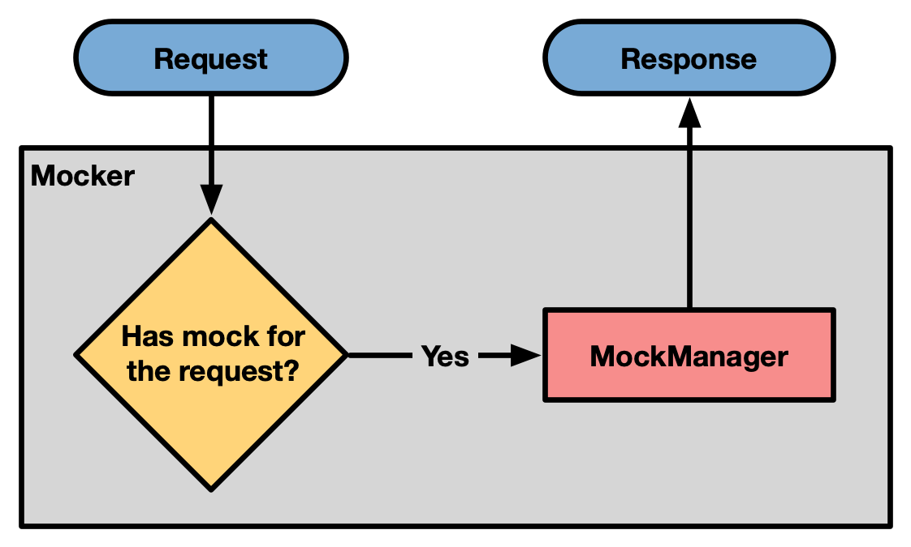
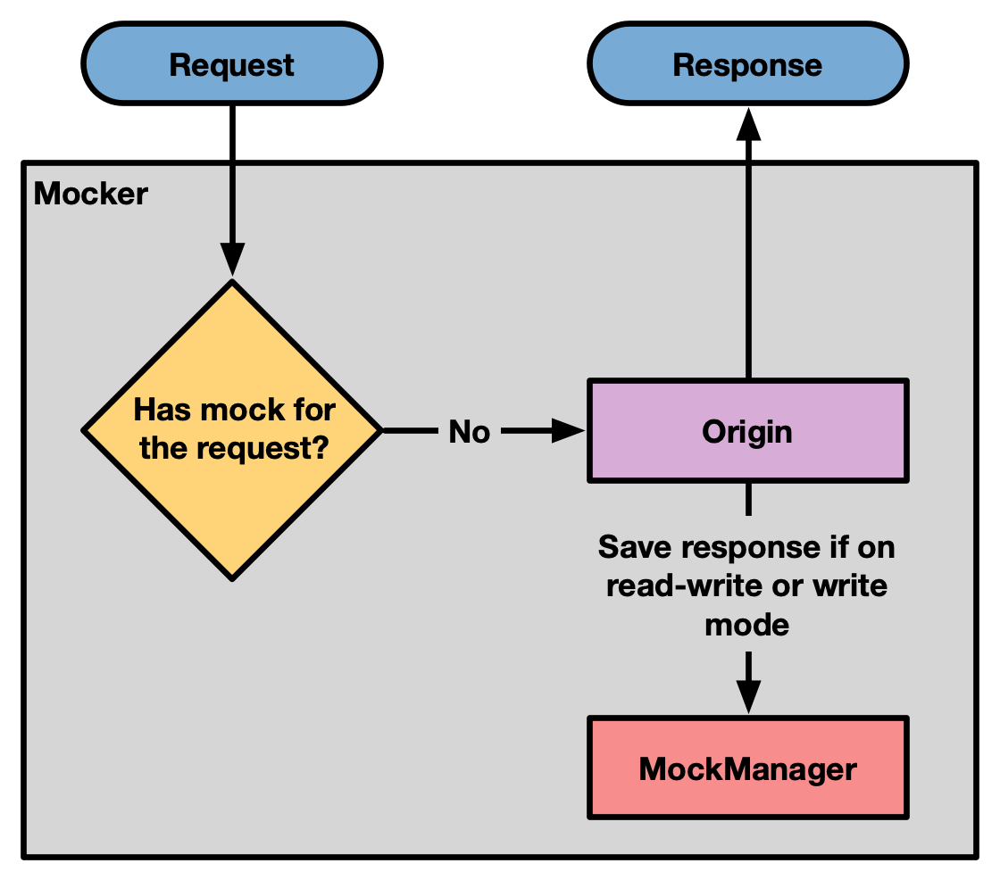
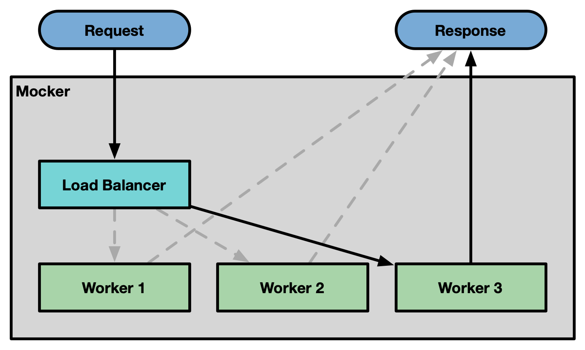
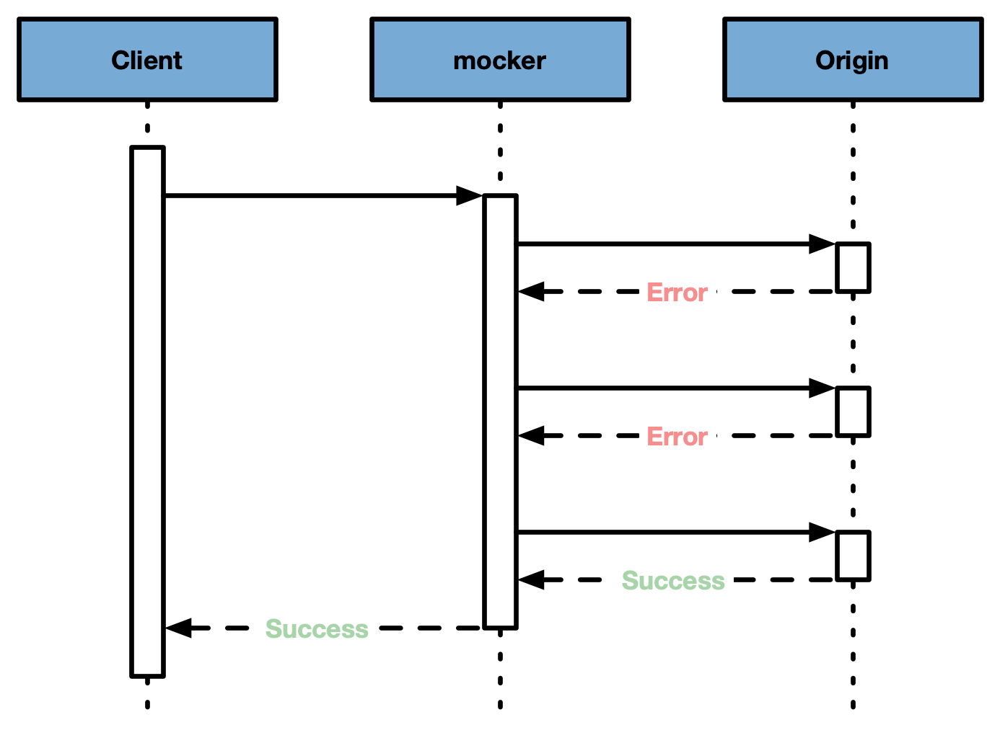

# Architecture

> 💡**Tip**
>
> It's recommended to read first the [Terminology](./terminology.md) docs before
> jumping into the architecture.

## Data flow

A response can either come from a previous mocked response or directly from
origin.

### Checking if there is a mocked response for a given request

HTTP is a pure text protocol over a TCP socket. A request comes to the server as
follows:

```
POST /test HTTP/1.1                             ━━━ HTTP method + URL + HTTP version
Host: foo.example                               ━┓
Content-Type: application/json                   ┃━ Headers
Connection: keep-alive                          ━┛
                                                ━━━ New line (CRLF) to separate Headers and Body
{                                               ━┓
  "foo": 1,                                      ┃
  "bar": 2,                                      ┃━ Body
}                                               ━┛
```

Based on the values of `--mockKeys` we pick different attributes from the
request to create a hash and then we check if a file with that name exists.

Let's say that we have `--mockKeys url,method,body`. For each request we would
get the URL, HTTP method and body to create a hash of those values. That gives
us an id that represents that request.

```
const filename = `${hash(`${url} ${method} ${body}`)}.json`
```

If a file with a filename equals to `filename` exists on `--responsesDir`, we
use that file as a mocked response.

### Has mocked response for the request

In case there is a mocked request there is no need to fetch from origin and a
response is created from the mocked response file saved on disk.



### No mocked response for the request

In case there is no mocked response for the request we fetch from origin and, if
`--mode` is equal to `read` or `read-write`, the response is saved on disk to be
used as a mocked response for future requests.



## Cluster mode and Error handling

Mocker runs in [cluster mode](https://nodejs.org/api/cluster.html). There is a
main process that sits in front of all workers acting as a load balancer. The
number of workers is determinded by the flag `--workers`.

> 💡**Tip**
>
> Use `--workers` equal to the number of CPU cores in the host machine to better
> use the machine hardware.

The main process also works as a supervisor, respawning a new worker if one
dies. That is possible because all mocker workers are stateless, since state is
saved in files on disk (the mocked responses).



By removing the state from the workers and having a supervisor it's possible to
use error handling in a similar fashion as it's done in Erlang:
[Let It Crash](http://stratus3d.com/blog/2020/01/20/applying-the-let-it-crash-philosophy-outside-erlang/#:~:text=One%20of%20the%20ideas%20at,certain%20faults%20to%20go%20unhandled.).
Mocker will not try to recover from errors. It will instead just let the process
die, log it, and respawn a new one. That greatly simplifies error handling and
improves the reliability of the application.

## Automatic retries for improved resilience on network

It's possible to start mocker with `--retry N` for it to work as a network
resiliency layer. Specially useful in conjunction with `--mode pass`.



## Secrets hidding

It's possible to redact tokens and secrets from the request and response headers
before saving them to the response mocks or logging them on screen using the
param `--redactedHeaders`. The redacted headers will be replaced by
`'[REDACTED]'`;

## Folder structure

### `./mocker`

Entry point for CLI. It parses the args coming from the `argv` and uses it to
create a mocker instance.

### `src/`

All lib code lives here.

### `src/index`

Library entry point.

### `src/mock-manager`

`MockManager` is responsible to...manage the mocks we have saved on disk. It
implements a subset of the
[Map](https://developer.mozilla.org/en-US/docs/Web/JavaScript/Reference/Global_Objects/Map#Instance_methods)
API.

- `has()`
- `set`
- `get`
- `delete`
- `clear`

### `src/origin`

Logic related with fetching responses from origin.

### `src/args`

Parses args from argv.
