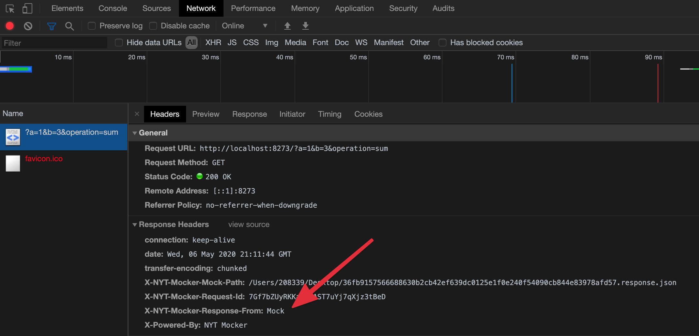
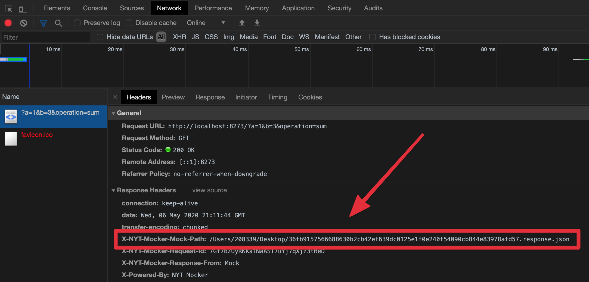

# FAQ

## How do I know if a given URL was served from disk or from origin?

Check for the `x-mocker-response-from` HTTP header. It will have the `mock`
value if the response was created from a file, or `origin` if it comes from
origin.



## How do I know from which file the response was created?

For responses created from a mocked response file, it will have the following
HTTP header:

- `x-mocker-mock-path: /path/to/the/mocked/response.json`



Just edited the file on that path and replay the request.

## Why the response files have this weird name?

The file name is a sha256 of all mock keys passed on `--mockKeys` as argument.

## How do I edit a response?

The response is a JSON file with 2 keys on the upper level:

- `request`
- `response`

`request` is there mostly for debugging.

`response` is used to send a response to the user agent. It has 3 keys:

- `statusCode`
- `headers`
- `body`

If there is an entry `"content-type": "application-json"` on `response.headers`
that means the `body` value was saved as JSON for better readability, instead of
a string. Otherwise the `body` is saved as a string.

## How do I create a mock response from scratch?

The easiets way is to run mocker in `writer` mode (`--mode writer`), fire the
response, and then edit the mocked response file.

For creating a mocked response from scratch it's a bit more involved.

1. Generate the filename

Generate the file name for the mocked response file. The name is a
[sha256](https://en.wikipedia.org/wiki/SHA-2) of the `mockKeys` passed as
argument. Let's say our `mockKeys` are `method,url`. In that case we could
calculate the file name with the below command.

```bash
echo "$(echo 'GET http://example.com' | shasum --algorithm 256 | cut -c 1-64).json" | pbcopy
```

2. Create a file with that name

```bash
pbpaste | xargs touch
```

3. Populate that file

```js
{
  response: {
    statusCode: 200,
    headers: [],
    body: "Lorem Ipsum"
  }
}
```

4. Replay the request

